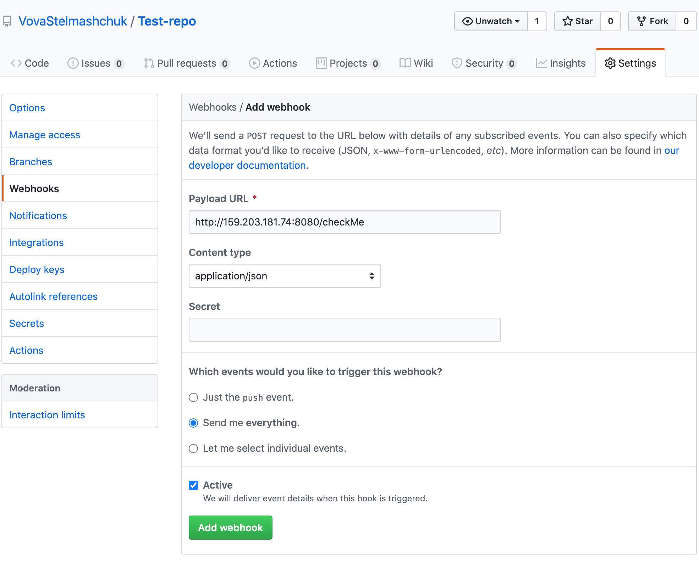

# GoodReadMe
The app update version of library in your ReadMe file.

## How it's work
GitHub send webhook about new release -> App fork your repo -> App create pull request with change in your ReadMe file.

## Setup
### By GitHub WebHook
Add webhook to GitHub repo:
 - Payload URL: `http://159.203.181.74:8080/checkMe`
 - Content type: `application/json`
 - Which events would you like to trigger this webhook?: `everything`


## Setup app for self host usage.
### Easy run (DockerHub)
```shell script
docker pull vovochkastelmashchuk/good-readme:0.9
docker run -p 8080:8080 --env GIT_HUB_TOKEN=<Github token> --rm vovochkastelmashchuk/good-readme:0.9
```

### Run from source code with docker
Change github.token in [application.conf](resources/application.conf)
Build jar file
```shell script
./gradlew shadowJar 
```
Build docker image
```shell script
docker build --tag good-readme .
```
Run docker image
```shell script
docker run -p 8080:8080 --env GIT_HUB_TOKEN=<Your github token> --rm good-readme
```

### Run from source code
Change github.token in [application.conf](resources/application.conf)
Build and run jar file
```shell script
./gradlew shadowJar && java -jar /build/libs/updatereadme.jar 
```
  

